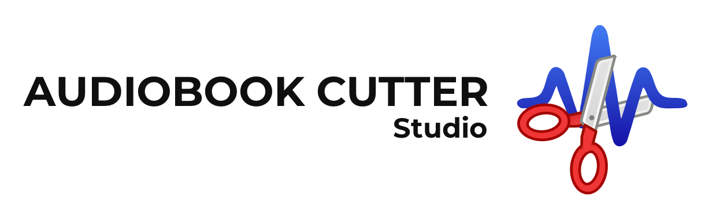

# Audiobook Cutter Studio Resources

This repository contains supporting resources for Audiobook Cutter Studio, including FFmpeg build scripts, FFmpeg binaries, upstream source archives, and related materials.

The Audiobook Cutter Studio application itself is proprietary and is not included in this repository.

## Official Webpage

- https://buymeacoffee.com/audiobookcutter
- https://www.audiobookcutter.de/
- https://www.audiobookcutter.com/

## Evolution of Audiobook Cutter

Audiobook Cutter has evolved through three main stages.

### 1. Audiobook Cutter (2006–2013)

The original Audiobook Cutter was a Windows desktop application published on SourceForge under the GPL. Its core purpose was to split large spoken-word MP3 files into smaller parts without re-encoding, while automatically generating ID3 tags, titles, and chapter numbers.

### 2. Audiobook Cutter Free & Pro Edition (2008–2026)

The later Free and Pro editions continued this concept as more polished consumer products. The focus remained on Windows and MP3 audiobook cutting, while adding features such as pause detection, extended ID3 tagging, and more precise control over cut behavior. Accessibility also became a stronger focus, particularly for visually impaired users.

A key feature of the Pro edition was silence-based split-point detection, which made long audiobooks and podcasts easier to manage. This generation marked the first major rewrite of the original tool.

The Free Edition `1.9.4` released in 2021 is still available for download:

- ⬇️ Windows application binary [`AudiobookCutterFE.exe`](https://raw.githubusercontent.com/philipphenkel/audiobook-cutter-studio-resources/main/audiobookcutter-cutter-free-1.9.4/AudiobookCutterFE.exe) (multi-language)
- ⬇️ Windows installer [`AudiobookCutterFE.msi`](https://raw.githubusercontent.com/philipphenkel/audiobook-cutter-studio-resources/main/audiobookcutter-cutter-free-1.9.4/AudiobookCutterFE.msi) (installer in English; installed application supports multiple languages)

### 3. Audiobook Cutter Studio (2026–present)

Audiobook Cutter Studio is a complete rewrite built on a new architecture. It extends the original chapter-splitting concept to from Windows to macOS, broadens input and output format support, and bundles an optimized FFmpeg command-line tool as the foundation for media analysis and cutting.

One distinctive Studio feature is its interactive chapter-splitting simulation. When the target chapter length is adjusted, the application immediately previews the resulting number of chapters and their estimated lengths. It also allows the user to listen to the beginning of a chapter before exporting.

## FFmpeg

Audiobook Cutter Studio uses a bundled FFmpeg command-line tool for analysis and cutting. Studio does not link against FFmpeg, and the bundled binary can be replaced with a custom build by starting the application with an explicit binary path.

Thanks to the FFmpeg project and its community for making this possible.

### FFmpeg binaries

This repository redistributes Audiobook Cutter Studio's bundled FFmpeg command-line binaries:

- macOS Apple Silicon [`ffmpeg-aarch64-apple-darwin`](ffmpeg/ffmpeg-aarch64-apple-darwin)
- macOS Intel [`ffmpeg-x86_64-apple-darwin`](ffmpeg/ffmpeg-x86_64-apple-darwin)
- Windows [`ffmpeg-x86_64-pc-windows-msvc.exe`](ffmpeg/ffmpeg-x86_64-pc-windows-msvc.exe)
- Checksums in [`ffmpeg/SHA256SUMS`](ffmpeg/SHA256SUMS) and a machine-readable inventory in [`ffmpeg/manifest.json`](ffmpeg/manifest.json)

### License and source code materials

The FFmpeg binaries in this repository are intended for redistribution as LGPL v2.1-or-later builds. The build configuration does not enable `--enable-gpl`, `--enable-version3`, or `--enable-nonfree`.

The exact configuration and platform-specific build steps used for the redistributed binaries are defined in:

- [`ffmpeg/build-ffmpeg-deps.sh`](ffmpeg/build-ffmpeg-deps.sh)
- [`ffmpeg/build-ffmpeg-apple-darwin.sh`](ffmpeg/build-ffmpeg-apple-darwin.sh)
- [`ffmpeg/build-ffmpeg-x86_64-pc-windows-msvc.sh`](ffmpeg/build-ffmpeg-x86_64-pc-windows-msvc.sh)

No local patches are applied to FFmpeg, LAME, or Opus by these build scripts. The corresponding upstream source archives included in this repository are:

- FFmpeg `n8.0.1`: [`ffmpeg/FFmpeg-n8.0.1.tar.gz`](ffmpeg/FFmpeg-n8.0.1.tar.gz)
- LAME `3.100`: [`lame/lame-3.100.tar.gz`](lame/lame-3.100.tar.gz)
- Opus `1.5.2`: [`opus/opus-1.5.2.tar.gz`](opus/opus-1.5.2.tar.gz)

The license texts and upstream licensing notices included in this repository are:

- FFmpeg LGPL v2.1: [`ffmpeg/COPYING.LGPLv2.1`](ffmpeg/COPYING.LGPLv2.1)
- LAME licensing materials: [`lame/COPYING`](lame/COPYING) and [`lame/license.txt`](lame/license.txt)
- Opus BSD 3-Clause license: [`opus/COPYING`](opus/COPYING)

LAME is used as the external `libmp3lame` library in the bundled FFmpeg builds. The corresponding LAME source archive and upstream licensing files are included as part of the redistribution materials.

Opus is used as the external `libopus` library in the bundled FFmpeg builds. Its corresponding source archive and BSD 3-Clause license text are also included as part of the redistribution materials.

### Codec patent notice

This repository provides software and source-code redistribution materials. Patent rights relating to media codecs may vary by codec and jurisdiction and are separate from copyright licenses. Users are responsible for assessing any patent requirements relevant to their use and distribution.
